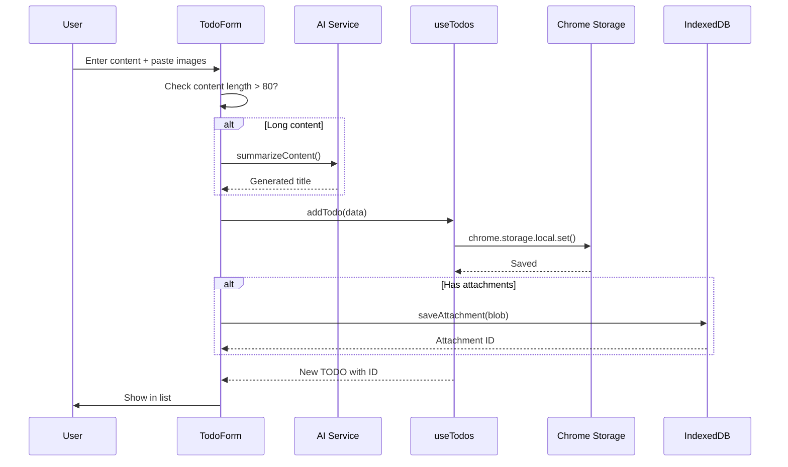
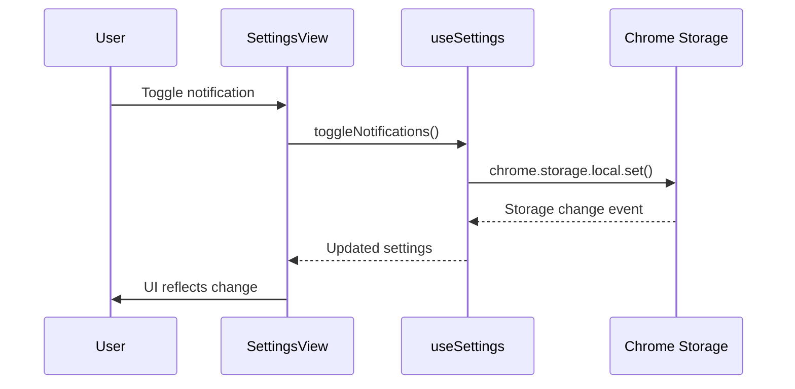

# Chrome Extension Architecture Documentation

> **Author**: haiping.yu@zoom.us  
> **Last Updated**: 2026-01-19  
> **Purpose**: Technical reference for AI-assisted development (Cursor, Claude Code, etc.)

---

## Table of Contents

1. [Project Overview](#1-project-overview)
2. [TODO Module](#2-todo-module)
3. [Knowledge Base Module](#3-knowledge-base-module)
4. [Settings Module](#4-settings-module)
5. [Shared Infrastructure](#5-shared-infrastructure)
6. [Data Flow Diagrams](#6-data-flow-diagrams)
7. [File Structure](#7-file-structure)
8. [Development Guidelines](#8-development-guidelines)

---

## 1. Project Overview

### Tech Stack

| Category | Technology |
|----------|------------|
| Runtime | Chrome Extension (Manifest V3) |
| Language | TypeScript 5.x |
| UI Framework | React 18.x |
| Styling | Tailwind CSS 3.x |
| Build Tool | Vite 5.x |
| Storage | Chrome Storage API + IndexedDB |
| AI Integration | OpenAI / Anthropic / DeepSeek / Qwen compatible |

### Architecture Pattern

```
┌─────────────────────────────────────────────────────────────┐
│                      Popup UI (React)                        │
├─────────────────────────────────────────────────────────────┤
│  Components  │  Hooks  │  Utils                              │
├──────────────┴─────────┴────────────────────────────────────┤
│                    Chrome Storage API                        │
│                    IndexedDB (attachments)                   │
├─────────────────────────────────────────────────────────────┤
│               Service Worker (Background)                    │
│               - Alarms, Notifications, Context Menus         │
└─────────────────────────────────────────────────────────────┘
```

---

## 2. TODO Module

### 2.1 Feature Overview

| Feature | Description | Status |
|---------|-------------|--------|
| CRUD Operations | Add, edit, delete, toggle TODOs | ✅ Done |
| Priority System | Low / Medium / High / Urgent with colors | ✅ Done |
| Deadline & Progress | Date picker + visual progress bar | ✅ Done |
| Reminders | Chrome Alarms for notifications | ✅ Done |
| Attachments | Image paste/upload with thumbnails | ✅ Done |
| AI Summary | Auto-generate title from long content | ✅ Done |
| Tags | Custom tags for organization | ✅ Done |
| Filtering | All / Active / Completed tabs | ✅ Done |

### 2.2 Component Architecture

```
src/popup/Popup.tsx
└── TodosView
    ├── TodoList
    │   └── TodoItem
    │       ├── PriorityBadge
    │       └── DeadlineProgressBar
    └── TodoForm
        ├── PrioritySelect
        ├── DateTimePicker
        └── ImageUploader
```

### 2.3 Data Model

```typescript
// src/types/index.ts

interface Todo {
  id: string;
  title: string;
  description?: string;
  status: 'pending' | 'in_progress' | 'completed' | 'cancelled';
  priority: 'low' | 'medium' | 'high' | 'urgent';
  deadline?: Date;
  reminder?: Date;
  completedAt?: Date;
  tags: string[];
  category?: string;
  attachments: Attachment[];
  createdAt: Date;
  updatedAt: Date;
}

interface Attachment {
  id: string;
  type: 'image' | 'file';
  name: string;
  size: number;
  mimeType: string;
}
```

### 2.4 Storage Strategy

| Data | Storage | Reason |
|------|---------|--------|
| TODO metadata | `chrome.storage.local` | Small, needs sync events |
| Attachments (Blob) | IndexedDB | Large binary data |

**Storage Keys:**
- `todos` - Array of TODO objects (dates as ISO strings)

### 2.5 Key Files

| File | Purpose |
|------|---------|
| `src/hooks/useTodos.ts` | CRUD operations, Chrome Storage sync |
| `src/hooks/useAttachments.ts` | IndexedDB attachment management |
| `src/utils/indexeddb.ts` | IndexedDB wrapper with thumbnail generation |
| `src/utils/ai.ts` | AI summarization service |
| `src/components/TodoList.tsx` | List with filtering and sorting |
| `src/components/TodoItem.tsx` | Individual item with progress bar |
| `src/components/TodoForm.tsx` | Add/edit form with smart input |
| `src/components/ImageUploader.tsx` | Drag, paste, upload images |
| `src/components/DateTimePicker.tsx` | Date/time selection with quick options |
| `src/components/PrioritySelect.tsx` | Priority selector with colored labels |

### 2.6 Key Algorithms

#### Auto-Summary Logic (`TodoForm.tsx`)

```
Input Content
    │
    ▼
Length > 80 chars?
    │
    ├── No  → Use as title directly
    │
    └── Yes → AI Configured?
                │
                ├── Yes → Call AI API for summary
                │
                └── No  → Local summary (first sentence/truncate)
                            │
                            ▼
                      Title = Summary
                      Description = Original content
```

#### Deadline Progress (`TodoItem.tsx`)

```typescript
progress = (now - createdAt) / (deadline - createdAt) * 100

urgency:
  - progress < 50%  → 'normal' (blue)
  - progress < 80%  → 'warning' (yellow)
  - progress >= 80% → 'danger' (red)
```

---

## 3. Knowledge Base Module

### 3.1 Feature Overview

| Feature | Description | Status |
|---------|-------------|--------|
| Save Current Page | One-click save with content extraction | ✅ Done |
| Manual URL Input | Add URLs manually | ✅ Done |
| Note Creation | Create notes without URL | ✅ Done |
| AI Summary | Auto-generate article summaries | ✅ Done |
| Keyword Extraction | Extract keywords from content | ✅ Done |
| Category Suggestion | AI-suggested categories | ✅ Done |
| Search & Filter | Search by title, keywords, tags | ✅ Done |
| Detail View | View full content with Q&A | ✅ Done |

### 3.2 Component Architecture

```
src/popup/Popup.tsx
└── KnowledgeView
    ├── QuickSaveButton
    ├── KnowledgeList
    │   └── KnowledgeItem
    ├── KnowledgeForm
    └── KnowledgeDetail
```

### 3.3 Data Model

```typescript
interface KnowledgeItem {
  id: string;
  type: 'article' | 'note';
  url?: string;
  title: string;
  content?: string;
  summary?: string;
  keywords: string[];
  tags: string[];
  category?: string;
  status: 'pending' | 'processing' | 'ready' | 'error';
  createdAt: Date;
  updatedAt: Date;
}
```

### 3.4 Storage

| Data | Storage | Reason |
|------|---------|--------|
| Knowledge items | IndexedDB | Large content storage |
| Processing queue | Chrome Storage | Service worker access |

### 3.5 Key Files

| File | Purpose |
|------|---------|
| `src/hooks/useKnowledge.ts` | CRUD operations for knowledge items |
| `src/utils/content-extractor.ts` | Extract content from web pages |
| `src/utils/ai.ts` | Article summary, keyword extraction |
| `src/utils/indexeddb.ts` | Knowledge store in IndexedDB |
| `src/components/KnowledgeList.tsx` | List with search and filtering |
| `src/components/KnowledgeItem.tsx` | Single item card |
| `src/components/KnowledgeForm.tsx` | Add URL or note form |
| `src/components/KnowledgeDetail.tsx` | Full article view with Q&A |

### 3.6 Processing Flow

```
User saves page/URL
    │
    ▼
Content Script extracts content
    │
    ▼
Save to IndexedDB (status: pending)
    │
    ▼
AI Processing (background)
    ├── Generate Summary
    ├── Extract Keywords
    └── Suggest Category
    │
    ▼
Update item (status: ready)
```

---

## 4. Settings Module

### 4.1 Feature Overview

| Feature | Description | Status |
|---------|-------------|--------|
| AI Provider Config | OpenAI / Anthropic / DeepSeek / Qwen / Custom | ✅ Done |
| Theme | Light / Dark / System | ✅ Done |
| Notifications | Enable/disable reminders | ✅ Done |
| Auto Summarize | Toggle AI summary feature | ✅ Done |
| Data Export | Backup all data as JSON | ✅ Done |
| Data Clear | Reset all data | ✅ Done |

### 4.2 Component Architecture

```
src/popup/Popup.tsx
└── SettingsView
    ├── SettingsSection
    │   ├── AIProviderConfig
    │   ├── ThemeSelector
    │   └── ToggleSwitch
    └── Button (Export/Clear)
```

### 4.3 Data Model

```typescript
// src/types/index.ts

type AIProvider = 'openai' | 'anthropic' | 'deepseek' | 'qwen' | 'custom';

interface AIConfig {
  provider: AIProvider;
  openai?: { apiKey: string; baseUrl?: string; model: string; embeddingModel: string; };
  anthropic?: { apiKey: string; baseUrl?: string; model: string; };
  deepseek?: { apiKey: string; baseUrl?: string; model: string; };
  qwen?: { apiKey: string; baseUrl?: string; model: string; };
  custom?: { name: string; baseUrl: string; apiKey: string; model: string; };
  maxTokens?: number;
  temperature?: number;
  timeout?: number;
}

interface AppSettings {
  theme: 'light' | 'dark' | 'system';
  notifications: boolean;
  autoSummarize: boolean;
  summaryThreshold: number;
  syncEnabled: boolean;
  reminderDefaults: { beforeDeadline: number; };
}
```

### 4.4 Storage Keys

| Key | Type | Description |
|-----|------|-------------|
| `app_settings` | AppSettings | Theme, notifications, etc. |
| `ai_config` | AIConfig | AI provider configuration |

### 4.5 Key Files

| File | Purpose |
|------|---------|
| `src/hooks/useSettings.ts` | App settings management |
| `src/hooks/useAIConfig.ts` | AI config with test connection |
| `src/components/SettingsSection.tsx` | Section container, ToggleSwitch |
| `src/components/ThemeSelector.tsx` | Theme mode selector |
| `src/components/AIProviderConfig.tsx` | Provider selection and config form |

### 4.6 AI Service Integration

```
┌──────────────────────────────────────────────────────────────┐
│                     AIProviderConfig                          │
│  ┌─────────────────────────────────────────────────────────┐ │
│  │ [OpenAI] [Anthropic] [DeepSeek] [Qwen] [Custom]         │ │
│  ├─────────────────────────────────────────────────────────┤ │
│  │ API Key: [••••••••••••••••]  👁                          │ │
│  │ Model:   [gpt-3.5-turbo    ]                             │ │
│  │ Base URL: (optional for proxy)                          │ │
│  ├─────────────────────────────────────────────────────────┤ │
│  │ [Test Connection]                                        │ │
│  │ ✓ Connection successful!                                 │ │
│  └─────────────────────────────────────────────────────────┘ │
└──────────────────────────────────────────────────────────────┘
```

**API Call Flow (`src/utils/ai.ts`):**

```
summarizeContent(content)
    │
    ▼
getAIConfig() from chrome.storage
    │
    ▼
Build request based on provider
    │
    ├── OpenAI format: Authorization: Bearer {key}
    ├── Anthropic: x-api-key header
    └── Others: OpenAI-compatible format
    │
    ▼
POST /chat/completions
    │
    ▼
Return summary text
```

---

## 5. Shared Infrastructure

### 5.1 Custom Hooks

| Hook | File | Purpose |
|------|------|---------|
| `useStorage<T>` | `src/hooks/useStorage.ts` | Generic Chrome Storage hook |
| `useTodos` | `src/hooks/useTodos.ts` | TODO CRUD with sorting |
| `useAttachments` | `src/hooks/useAttachments.ts` | IndexedDB attachment ops |
| `usePendingAttachments` | `src/hooks/useAttachments.ts` | Pre-save attachment buffer |
| `useKnowledge` | `src/hooks/useKnowledge.ts` | Knowledge base CRUD |
| `usePendingKnowledge` | `src/hooks/useKnowledge.ts` | Pending URL management |
| `useSettings` | `src/hooks/useSettings.ts` | App settings with theme apply |
| `useAIConfig` | `src/hooks/useAIConfig.ts` | AI config with test |

### 5.2 UI Components

| Component | Props | Description |
|-----------|-------|-------------|
| `Button` | variant, size, isLoading | Primary/Secondary/Danger/Ghost |
| `Input` | label, error | Form input with label |
| `ToggleSwitch` | checked, onChange | Boolean toggle |
| `SettingsSection` | title, description | Settings group container |
| `SettingsRow` | label, description | Single setting row |

### 5.3 Service Worker

**File:** `src/background/service-worker.ts`

| Feature | API Used |
|---------|----------|
| TODO Reminders | `chrome.alarms` |
| Notifications | `chrome.notifications` |
| Context Menus | `chrome.contextMenus` |
| Keyboard Shortcuts | `chrome.commands` |

---

## 6. Data Flow Diagrams

### 6.1 TODO Creation Flow



### 6.2 Settings Update Flow



---

## 7. File Structure

```
src/
├── popup/
│   ├── index.html          # Popup HTML entry
│   ├── main.tsx            # React entry point
│   └── Popup.tsx           # Main popup with tabs
│
├── components/
│   ├── index.ts            # Component exports
│   ├── Button.tsx          # Base button
│   ├── Input.tsx           # Base input
│   ├── TodoList.tsx        # TODO list with filters
│   ├── TodoItem.tsx        # Single TODO with progress
│   ├── TodoForm.tsx        # Add/edit form
│   ├── ImageUploader.tsx   # Drag/paste/upload
│   ├── DateTimePicker.tsx  # Date/time selection
│   ├── PrioritySelect.tsx  # Priority buttons
│   ├── AIAnalysisPanel.tsx # AI TODO analysis panel
│   ├── KnowledgeList.tsx   # Knowledge items list
│   ├── KnowledgeItem.tsx   # Single knowledge item
│   ├── KnowledgeForm.tsx   # Add URL/note form
│   ├── KnowledgeDetail.tsx # Article detail view
│   ├── SettingsSection.tsx # Settings container
│   ├── ThemeSelector.tsx   # Theme buttons
│   └── AIProviderConfig.tsx# AI config form
│
├── hooks/
│   ├── index.ts            # Hook exports
│   ├── useStorage.ts       # Generic storage hook
│   ├── useTodos.ts         # TODO operations
│   ├── useAttachments.ts   # Attachment operations
│   ├── useKnowledge.ts     # Knowledge base operations
│   ├── useSettings.ts      # App settings
│   └── useAIConfig.ts      # AI configuration
│
├── utils/
│   ├── indexeddb.ts        # IndexedDB wrapper (attachments + knowledge)
│   ├── ai.ts               # AI service client (summarize, keywords, priorities)
│   ├── content-extractor.ts # Web page content extraction
│   └── storage.ts          # Storage utilities
│
├── types/
│   ├── index.ts            # All type definitions
│   └── database.ts         # Supabase types (future)
│
├── background/
│   └── service-worker.ts   # Alarms, notifications
│
├── content/
│   └── content.ts          # Content script (future)
│
└── styles/
    └── globals.css         # Tailwind directives
```

---

## 8. Development Guidelines

### 8.1 Adding a New Feature

1. **Define Types** in `src/types/index.ts`
2. **Create Hook** in `src/hooks/` for state management
3. **Create Components** in `src/components/`
4. **Export** from `index.ts` files
5. **Integrate** into Popup.tsx or relevant view
6. **Test** with `pnpm build`

### 8.2 Chrome Storage Patterns

```typescript
// Reading with default
const result = await chrome.storage.local.get(KEY);
const data = result[KEY] || DEFAULT_VALUE;

// Writing
await chrome.storage.local.set({ [KEY]: data });

// Listening for changes
chrome.storage.onChanged.addListener((changes, areaName) => {
  if (areaName === 'local' && changes[KEY]) {
    const newValue = changes[KEY].newValue;
    // Update state
  }
});
```

### 8.3 Date Handling

- **Storage**: ISO string format (`date.toISOString()`)
- **Runtime**: JavaScript `Date` objects
- **Display**: Use `date-fns` for formatting

### 8.4 Error Handling

```typescript
try {
  await someOperation();
} catch (error) {
  const message = error instanceof Error ? error.message : 'Unknown error';
  // Show user-friendly error
  // Log for debugging
  console.error('Operation failed:', error);
}
```

### 8.5 AI Integration

To add a new AI provider:

1. Add type to `AIProvider` union in `src/types/index.ts`
2. Add config interface (e.g., `NewProviderConfig`)
3. Add to `AIConfig` interface
4. Add default config in `src/hooks/useAIConfig.ts`
5. Add to `AI_PROVIDERS` array
6. Update `getProviderEndpoint()` in `src/utils/ai.ts`

---

## Quick Reference

### Storage Keys

| Key | Content |
|-----|---------|
| `todos` | TODO[] (dates as ISO strings) |
| `app_settings` | AppSettings object |
| `ai_config` | AIConfig object |

### IndexedDB

| Database | Store | Index |
|----------|-------|-------|
| `ai-assistant-db` | `attachments` | `by-todo` (todoId) |
| `ai-assistant-db` | `knowledge` | `by-status`, `by-category`, `by-created` |

### Chrome APIs Used

| API | Purpose |
|-----|---------|
| `chrome.storage.local` | Persist data |
| `chrome.storage.onChanged` | Sync state |
| `chrome.alarms` | Scheduled reminders |
| `chrome.notifications` | Show reminders |
| `chrome.contextMenus` | Right-click actions |
| `chrome.commands` | Keyboard shortcuts |

---

## Related Documentation

| Document | Path | Description |
|----------|------|-------------|
| PRD | `docs/PRD.md` | Product requirements and user stories |
| Roadmap | `docs/ROADMAP.md` | Upcoming features and implementation guides |
| Cursor Rules | `.cursor/rules/` | Coding standards and best practices |

---

*This document should be referenced when adding features or modifying existing functionality.*

