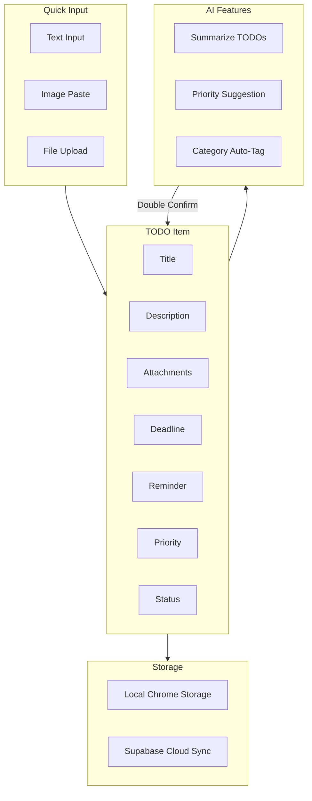
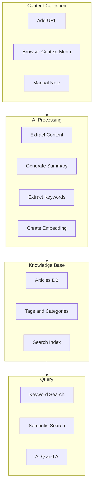
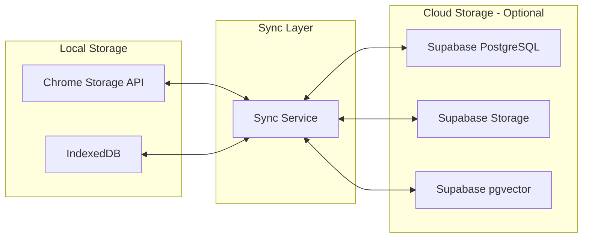
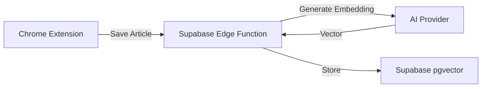

# AI Assistant Chrome Extension - 产品需求文档 (PRD)

> **Author**: haiping.yu@zoom.us  
> **Version**: 1.0.0  
> **Last Updated**: 2026-01-19  
> **Status**: Draft

---

## 1. 项目概述

### 1.1 产品愿景

打造一款 AI 赋能的个人效率工具 Chrome 扩展，帮助用户高效管理待办事项和构建个人知识库，解决"收藏即吃灰"的痛点。

### 1.2 目标用户

- 知识工作者（程序员、产品经理、设计师等）
- 需要管理大量待办事项的用户
- 经常阅读和收藏网页文章的用户
- 希望构建个人知识体系的终身学习者

### 1.3 技术栈

| 类别 | 技术选型 |
|------|---------|
| 平台 | Chrome Extension (Manifest V3) |
| 前端框架 | React 18 + TypeScript |
| 样式方案 | Tailwind CSS |
| 后端服务 | Supabase (Auth, Database, Storage, Realtime) |
| AI 服务 | OpenAI / Anthropic / DeepSeek / 通义千问 / 自定义 - 用户可配置 |
| 向量数据库 | Supabase pgvector |
| 构建工具 | Vite |
| 包管理 | pnpm |

### 1.4 核心功能模块

1. **TODO List Management** - AI 赋能的待办事项管理
2. **AI Knowledge Base** - 个人专属知识库

---

## 2. 功能模块一：TODO List Management

### 2.1 功能概述

一个快速、智能的待办事项管理系统，支持快捷添加、多媒体附件、AI 智能分析和提醒功能。

### 2.2 系统架构



### 2.3 功能详述

#### 2.3.1 快速添加 (P0 - Must Have)

| 功能点 | 描述 | 优先级 |
|-------|------|-------|
| Popup 快速输入 | 点击扩展图标，立即输入 TODO | P0 |
| 快捷键添加 | 全局快捷键呼出添加面板 | P1 |
| 右键菜单添加 | 选中网页文字，右键添加为 TODO | P1 |

#### 2.3.2 多媒体附件 (P0 - Must Have)

| 功能点 | 描述 | 优先级 |
|-------|------|-------|
| 多图片粘贴 | 支持 Ctrl+V 直接粘贴多张图片 | P0 |
| 文件上传 | 支持拖拽或选择文件上传 | P1 |
| 截图粘贴 | 支持粘贴系统截图 | P1 |
| 附件预览 | 支持图片缩略图预览 | P1 |

**技术说明**：
- 本地存储使用 IndexedDB 存储文件 Blob
- 云端同步使用 Supabase Storage
- 图片压缩后存储，原图可选

#### 2.3.3 时间管理 (P0 - Must Have)

| 功能点 | 描述 | 优先级 |
|-------|------|-------|
| Deadline 设置 | 设置截止日期和时间 | P0 |
| 提醒通知 | 到期前提醒（浏览器通知） | P0 |
| 重复任务 | 支持每日/每周/每月重复 | P2 |
| 日历视图 | 按日期查看 TODO | P2 |

**提醒规则**：
- 默认在截止时间前 1 小时提醒
- 用户可自定义提醒时间（提前 5分钟/15分钟/1小时/1天）
- 使用 Chrome Alarms API 实现

#### 2.3.4 AI 功能 (P1 - Should Have)

| 功能点 | 描述 | 优先级 |
|-------|------|-------|
| TODO 总结 | AI 对当前 TODO 列表进行总结归纳 | P1 |
| 优先级建议 | AI 分析并建议任务优先级排序 | P1 |
| 自动分类 | AI 自动为 TODO 打标签/分类 | P2 |
| 任务分解 | AI 将大任务分解为子任务 | P2 |

**交互设计**：
- AI 建议需要用户 **Double Confirm**（二次确认）才会应用
- 用户可以接受全部建议 / 部分接受 / 全部拒绝
- AI 操作记录可追溯

#### 2.3.5 多维度统计 (P2 - Nice to Have)

| 功能点 | 描述 | 优先级 |
|-------|------|-------|
| 完成率统计 | 日/周/月完成率图表 | P2 |
| 分类统计 | 按分类/标签统计任务分布 | P2 |
| 时间分析 | 任务耗时分析 | P3 |
| 趋势报告 | AI 生成效率趋势报告 | P3 |

### 2.4 用户故事

1. **作为用户**，我希望能在看到任何信息时快速记录 TODO，以便不会忘记重要事项
2. **作为用户**，我希望能直接粘贴多张截图到 TODO，以便保存相关视觉信息
3. **作为用户**，我希望设置截止时间并收到提醒，以便按时完成任务
4. **作为用户**，我希望 AI 帮我分析优先级，以便更好地规划工作
5. **作为用户**，我希望看到完成统计，以便了解自己的效率趋势

### 2.5 TODO 数据模型

```typescript
interface Todo {
  id: string;                    // UUID
  title: string;                 // 标题
  description?: string;          // 描述（支持 Markdown）
  status: 'pending' | 'in_progress' | 'completed' | 'cancelled';
  priority: 'low' | 'medium' | 'high' | 'urgent';
  
  // 时间相关
  deadline?: Date;               // 截止时间
  reminder?: Date;               // 提醒时间
  completedAt?: Date;            // 完成时间
  
  // 分类和标签
  category?: string;             // 分类
  tags: string[];                // 标签
  
  // 附件
  attachments: Attachment[];     // 附件列表
  
  // 元数据
  createdAt: Date;
  updatedAt: Date;
  syncedAt?: Date;               // 云端同步时间
  
  // AI 相关
  aiSuggestions?: AISuggestion[];  // AI 建议记录
}

interface Attachment {
  id: string;
  type: 'image' | 'file';
  name: string;
  size: number;
  mimeType: string;
  localPath?: string;            // IndexedDB key
  remotePath?: string;           // Supabase Storage path
  thumbnailPath?: string;        // 缩略图路径
}

interface AISuggestion {
  type: 'priority' | 'category' | 'summary';
  suggestion: unknown;
  accepted: boolean;
  createdAt: Date;
}
```

---

## 3. 功能模块二：AI 知识库

### 3.1 功能概述

解决"收藏即吃灰"的痛点，通过 AI 自动提取、总结、索引网页内容，构建可搜索、可问答的个人知识库。

### 3.2 系统架构



### 3.3 功能详述

#### 3.3.1 内容收集 (P0 - Must Have)

| 功能点 | 描述 | 优先级 |
|-------|------|-------|
| 一键保存当前页 | 点击扩展保存当前网页 | P0 |
| 右键保存链接 | 右键菜单保存任意链接 | P0 |
| 手动添加 URL | 输入 URL 手动添加 | P1 |
| 批量导入 | 导入浏览器书签 | P2 |

#### 3.3.2 AI 内容处理 (P0 - Must Have)

| 功能点 | 描述 | 优先级 |
|-------|------|-------|
| 内容提取 | 提取网页正文，过滤广告和无关内容 | P0 |
| 自动摘要 | AI 生成文章摘要（100-300字） | P0 |
| 关键词提取 | AI 提取核心关键词作为标签 | P1 |
| 向量嵌入 | 生成文章的 Embedding 向量 | P1 |

**处理流程**：
1. 用户添加 URL
2. 后台抓取网页内容（使用 Content Script 或 Edge Function）
3. AI 处理：提取正文 → 生成摘要 → 提取关键词 → 生成 Embedding
4. 存储到数据库

#### 3.3.3 知识管理 (P1 - Should Have)

| 功能点 | 描述 | 优先级 |
|-------|------|-------|
| 标签管理 | 手动/自动标签，支持层级 | P1 |
| 分类管理 | 文件夹式分类组织 | P1 |
| 笔记批注 | 为文章添加个人笔记 | P1 |
| 高亮标记 | 标记重点内容 | P2 |

#### 3.3.4 智能搜索 (P1 - Should Have)

| 功能点 | 描述 | 优先级 |
|-------|------|-------|
| 关键词搜索 | 传统全文搜索 | P0 |
| 语义搜索 | 基于 Embedding 的相似度搜索 | P1 |
| AI 问答 | 基于知识库的 RAG 问答 | P1 |
| 相关推荐 | 显示相关文章 | P2 |

**语义搜索原理**：
1. 用户输入查询
2. 将查询转换为 Embedding 向量
3. 使用 pgvector 在数据库中进行相似度搜索
4. 返回最相关的文章

**AI 问答流程**：
1. 用户提问
2. 语义搜索找到相关文章
3. 将相关内容作为上下文，调用 LLM
4. 返回答案，并标注信息来源

### 3.4 用户故事

1. **作为用户**，我希望一键保存有价值的文章，以便日后查阅
2. **作为用户**，我希望 AI 自动生成文章摘要，以便快速了解内容
3. **作为用户**，我希望用自然语言搜索知识库，而不只是关键词匹配
4. **作为用户**，我希望能向知识库提问并得到答案，以便高效获取信息
5. **作为用户**，我希望看到相关文章推荐，以便发现关联知识

### 3.5 知识库数据模型

```typescript
interface KnowledgeItem {
  id: string;                    // UUID
  type: 'article' | 'note';      // 类型：文章或笔记
  
  // 基础信息
  url?: string;                  // 原始 URL
  title: string;                 // 标题
  content: string;               // 提取的正文内容
  summary?: string;              // AI 生成的摘要
  
  // 分类和标签
  category?: string;
  tags: string[];                // AI + 手动标签
  
  // AI 处理结果
  keywords: string[];            // 提取的关键词
  embedding?: number[];          // 向量嵌入（1536维，OpenAI）
  
  // 用户批注
  notes?: string;                // 用户笔记
  highlights?: Highlight[];      // 高亮标记
  
  // 元数据
  source?: string;               // 来源网站
  author?: string;               // 作者
  publishedAt?: Date;            // 发布时间
  savedAt: Date;                 // 保存时间
  lastAccessedAt?: Date;         // 最后访问时间
  syncedAt?: Date;               // 云端同步时间
  
  // 处理状态
  status: 'pending' | 'processing' | 'ready' | 'error';
  processingError?: string;
}

interface Highlight {
  id: string;
  text: string;                  // 高亮文本
  note?: string;                 // 批注
  position: {                    // 位置信息
    start: number;
    end: number;
  };
  createdAt: Date;
}
```

---

## 4. 数据存储策略

### 4.1 存储架构

采用**混合存储模式**：默认本地存储，可选云端同步。



### 4.2 存储分配

| 数据类型 | 本地存储 | 云端同步 | 说明 |
|---------|---------|---------|------|
| TODO Items | Chrome Storage | Supabase (可选) | 小数据，需要快速访问 |
| 附件/图片 | IndexedDB | Supabase Storage (可选) | 大文件存储 |
| 知识库条目 | IndexedDB | Supabase (可选) | 文章内容较大 |
| 用户设置 | Chrome Storage | Supabase (可选) | 配置同步 |
| AI Embeddings | - | Supabase pgvector | 仅云端存储（需要向量搜索） |

### 4.3 同步策略

1. **增量同步**：只同步变更的数据
2. **冲突解决**：Last Write Wins + 用户确认
3. **离线支持**：本地优先，联网时自动同步
4. **数据加密**：敏感数据端到端加密（可选）

---

## 5. AI 服务配置

### 5.1 支持的 AI 提供商

| 提供商 | 模型 | 用途 | 默认 API Host |
|-------|------|------|--------------|
| OpenAI | GPT-4 / GPT-4-turbo | 复杂推理、问答 | api.openai.com |
| OpenAI | GPT-3.5-turbo | 日常任务、摘要 | api.openai.com |
| OpenAI | text-embedding-3-small | 向量嵌入 | api.openai.com |
| Anthropic | Claude 3 Opus | 复杂推理、长文本 | api.anthropic.com |
| Anthropic | Claude 3 Sonnet | 日常任务 | api.anthropic.com |
| Anthropic | Claude 3 Haiku | 快速任务 | api.anthropic.com |
| DeepSeek | DeepSeek-V3 | 高性价比推理 | api.deepseek.com |
| DeepSeek | DeepSeek-Coder | 代码相关任务 | api.deepseek.com |
| 通义千问 | Qwen-Max | 复杂推理、长文本 | dashscope.aliyuncs.com |
| 通义千问 | Qwen-Plus | 日常任务 | dashscope.aliyuncs.com |
| 通义千问 | Qwen-Turbo | 快速任务 | dashscope.aliyuncs.com |
| 自定义 | 用户指定 | 兼容 OpenAI API 格式 | 用户自定义 |

### 5.2 用户配置

```typescript
type AIProvider = 'openai' | 'anthropic' | 'deepseek' | 'qwen' | 'custom';

interface AIConfig {
  provider: AIProvider;
  
  // OpenAI 配置
  openai?: {
    apiKey: string;
    baseUrl?: string;            // 默认 https://api.openai.com/v1
    model: string;               // 默认 gpt-3.5-turbo
    embeddingModel: string;      // 默认 text-embedding-3-small
  };
  
  // Anthropic 配置
  anthropic?: {
    apiKey: string;
    baseUrl?: string;            // 默认 https://api.anthropic.com
    model: string;               // 默认 claude-3-sonnet-20240229
  };
  
  // DeepSeek 配置
  deepseek?: {
    apiKey: string;
    baseUrl?: string;            // 默认 https://api.deepseek.com
    model: string;               // 默认 deepseek-chat
  };
  
  // 通义千问配置
  qwen?: {
    apiKey: string;
    baseUrl?: string;            // 默认 https://dashscope.aliyuncs.com/compatible-mode/v1
    model: string;               // 默认 qwen-plus
  };
  
  // 自定义配置（兼容 OpenAI API 格式的服务）
  custom?: {
    name: string;                // 显示名称
    baseUrl: string;             // API 地址（必填）
    apiKey: string;              // API Token（必填）
    model: string;               // 模型名称（必填）
    embeddingModel?: string;     // 嵌入模型（可选）
    headers?: Record<string, string>;  // 自定义请求头
  };
  
  // 通用配置
  maxTokens?: number;
  temperature?: number;
  timeout?: number;              // 请求超时时间（毫秒）
}
```

### 5.3 自定义 AI 服务配置

支持任何兼容 OpenAI API 格式的服务，包括：
- 自建的 OpenAI 代理服务
- 本地运行的 LLM（如 Ollama、LocalAI、vLLM）
- 其他第三方 AI 服务

**配置示例**：

```typescript
// 使用 Ollama 本地模型
const ollamaConfig: AIConfig = {
  provider: 'custom',
  custom: {
    name: 'Ollama Local',
    baseUrl: 'http://localhost:11434/v1',
    apiKey: 'ollama',           // Ollama 不需要真实 key
    model: 'llama3.2',
  },
};

// 使用 Azure OpenAI
const azureConfig: AIConfig = {
  provider: 'custom',
  custom: {
    name: 'Azure OpenAI',
    baseUrl: 'https://your-resource.openai.azure.com/openai/deployments/your-deployment',
    apiKey: 'your-azure-api-key',
    model: 'gpt-4',
    headers: {
      'api-version': '2024-02-15-preview',
    },
  },
};
```

### 5.4 API Key 安全

- API Key 使用 Chrome Storage 加密存储
- 永远不会发送到除 AI 提供商以外的服务器
- 支持使用代理 URL（用户自建中转服务）
- 自定义配置的 baseUrl 需要用户明确确认（防止钓鱼）

### 5.5 Embedding 服务策略

> **参考文档**: [Supabase AI & Vectors](https://supabase.com/docs/guides/ai)

**首选方案：Supabase Edge Function + pgvector**

Supabase 提供了完整的 AI 工具包，包括：
- **pgvector**: 向量存储、索引和查询
- **Edge Functions**: 在服务端生成 Embedding
- **多种搜索方式**: 语义搜索、关键词搜索、混合搜索
- **第三方集成**: OpenAI、Hugging Face、LangChain、LlamaIndex 等

Embedding 生成优先通过 Supabase Edge Function 完成，好处是：
1. API Key 存储在服务端，客户端无需暴露
2. 统一在 Supabase 侧处理，减少客户端复杂度
3. 生成后直接存入 pgvector，减少网络传输
4. 便于批量处理和异步任务



### 5.6 Embedding 模型支持

| 优先级 | 提供商 | Embedding 模型 | 向量维度 | 说明 |
|-------|-------|---------------|---------|------|
| 1 | Supabase | 通过 Edge Function 调用 | 取决于底层模型 | **首选方案** |
| 2 | OpenAI | text-embedding-3-small | 1536 | 推荐，性价比高 |
| 3 | OpenAI | text-embedding-3-large | 3072 | 更高精度 |
| 4 | 通义千问 | text-embedding-v3 | 1024 | 阿里云 DashScope |
| 5 | 自定义 | 用户指定 | 用户指定 | 需兼容 OpenAI 格式 |
| - | DeepSeek | - | - | 暂不支持 Embedding |

**Supabase Edge Function 配置**：

```typescript
// Edge Function 环境变量（服务端存储，安全）
// OPENAI_API_KEY=sk-xxx
// 或其他 Embedding 服务的 Key

// 客户端只需调用 Edge Function
const { data, error } = await supabase.functions.invoke('generate-embedding', {
  body: { text: articleContent },
});
```

**注意**：不同 Embedding 模型的向量维度不同，切换模型后需要重新生成所有 Embedding。

---

## 6. 非功能需求

### 6.1 性能要求

| 指标 | 要求 |
|------|------|
| Popup 打开时间 | < 200ms |
| TODO 列表渲染 | < 100ms (1000条以内) |
| 本地搜索响应 | < 50ms |
| AI 请求超时 | 30s |

### 6.2 安全要求

参考 [security-security-baseline.mdc](../.cursor/rules/security-security-baseline.mdc)：

1. **输入验证**：所有用户输入必须验证和清理
2. **API Key 保护**：加密存储，不记录到日志
3. **XSS 防护**：使用 React 的内置防护，不使用 dangerouslySetInnerHTML
4. **CSRF 防护**：Supabase 调用使用 JWT 认证
5. **内容安全**：限制 Popup CSP 策略

### 6.3 隐私考量

1. **数据最小化**：只收集必要的数据
2. **本地优先**：默认数据存储在本地
3. **透明度**：明确告知用户数据使用方式
4. **用户控制**：用户可以导出、删除所有数据
5. **无追踪**：不使用任何分析追踪服务

### 6.4 可访问性

1. 支持键盘导航
2. 支持屏幕阅读器
3. 颜色对比度符合 WCAG 2.1 AA
4. 支持系统深色/浅色模式

---

## 7. 未来扩展

### 7.1 预留扩展点

1. **更多 AI 提供商**：Google Gemini、本地 LLM（Ollama）
2. **更多存储后端**：自托管数据库、其他云服务
3. **浏览器支持**：Firefox、Edge、Safari
4. **移动端**：配套移动应用

### 7.2 可能的新功能

1. **团队协作**：共享 TODO 和知识库
2. **日程集成**：与 Google Calendar、Outlook 集成
3. **阅读模式**：知识库文章的优雅阅读体验
4. **Markdown 编辑**：富文本笔记编辑
5. **网页标注**：在原网页上高亮和批注
6. **自动化**：IFTTT 风格的自动化规则

---

## 8. 版本规划

> 详细的开发路线图和实现指南请参考 [`docs/ROADMAP.md`](./ROADMAP.md)

### MVP (v1.0) ✅ 已完成

- [x] TODO 基础功能（添加、编辑、删除、完成）
- [x] 图片粘贴上传
- [x] Deadline 和提醒
- [x] 知识库基础功能（保存 URL、查看列表）
- [x] AI 摘要生成
- [x] 基础搜索
- [x] AI 优先级建议
- [x] AI TODO 总结
- [x] 快捷键支持
- [x] 右键菜单

### v1.1 🚧 进行中

- [ ] Supabase 用户认证
- [ ] TODO 云端同步
- [ ] 知识库云端同步
- [ ] 语义搜索（pgvector）

### v1.2 📋 计划中

- [ ] AI 问答（RAG）
- [ ] 多维度统计仪表板
- [ ] 高级标签和分类管理
- [ ] 数据导入导出

---

## 附录

### A. 术语表

| 术语 | 说明 |
|------|------|
| RAG | Retrieval-Augmented Generation，检索增强生成 |
| Embedding | 向量嵌入，将文本转换为高维向量 |
| pgvector | PostgreSQL 的向量扩展 |
| Double Confirm | 二次确认，用户需要明确同意才执行操作 |

### B. 参考资料

**Chrome Extension**
- [Chrome Extension Manifest V3](https://developer.chrome.com/docs/extensions/mv3/)

**Supabase**
- [Supabase Documentation](https://supabase.com/docs)
- [Supabase AI & Vectors](https://supabase.com/docs/guides/ai) - **AI 功能核心参考**
- [Supabase pgvector](https://supabase.com/docs/guides/ai/vector-columns) - 向量列和索引
- [Supabase Semantic Search](https://supabase.com/docs/guides/ai/semantic-search) - 语义搜索实现
- [Supabase Hybrid Search](https://supabase.com/docs/guides/ai/hybrid-search) - 混合搜索
- [Supabase Edge Functions + OpenAI](https://supabase.com/docs/guides/ai/examples/openai) - Edge Function 生成 Embedding

**AI 服务提供商**
- [OpenAI API Reference](https://platform.openai.com/docs/api-reference)
- [Anthropic API Reference](https://docs.anthropic.com/claude/reference)
- [DeepSeek API](https://platform.deepseek.com/docs)
- [通义千问 DashScope](https://help.aliyun.com/zh/dashscope/)

